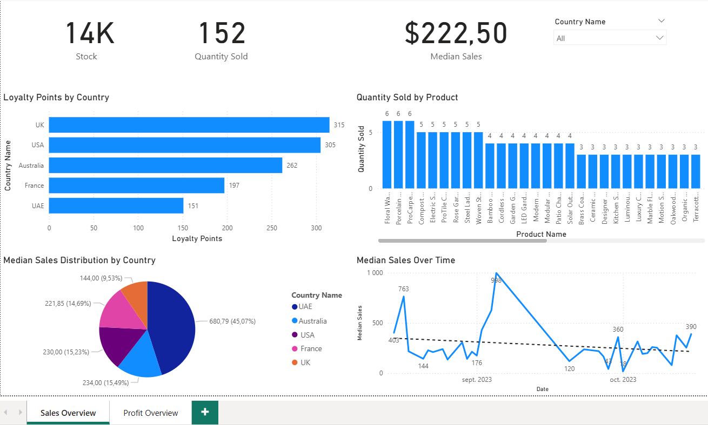
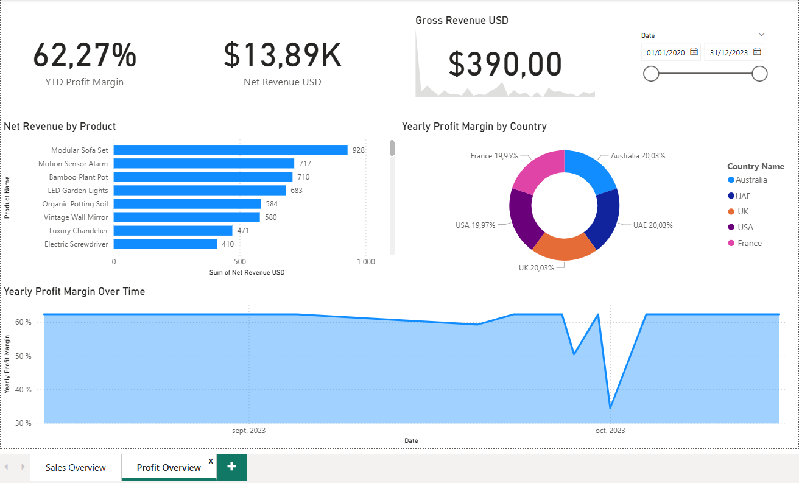

# 📊 Tailwind Traders — Power BI Capstone Project

> An end-to-end Business Intelligence dashboard built with Microsoft Power BI, analyzing sales, profitability, and customer behavior for the fictional retail company **Tailwind Traders**.

---

## 📁 Project Overview

This capstone project was developed as part of the **Microsoft Power BI Data Analyst Professional Certificate** (Coursera). It demonstrates core Power BI competencies (data modeling, DAX, interactive report design) applied to a realistic retail dataset.

The report is structured across **two dashboard pages**:

| Page | Focus |
|------|-------|
| **Sales Overview** | Stock levels, quantity sold, loyalty points, median sales by country and product |
| **Profit Overview** | Net revenue, profit margin, gross revenue trends by product and country |

---

## 🗂️ Dataset

**Source:** Tailwind Traders Sample Dataset (Microsoft)

The dataset covers retail transactions across multiple countries and product categories, including:

- Product names, categories, and stock quantities
- Sales amounts (gross and net revenue in USD)
- Profit margins
- Customer loyalty points
- Transaction dates (2020–2023)
- Country dimensions: **Australia, UAE, UK, USA, France**

---

## 📐 Data Model

The report is built on a **star schema** with:
- A central **fact table** (sales transactions)
- Supporting **dimension tables** (Products, Countries, Date)
- Relationships managed via Power BI's Model View

---

## 🧮 Key DAX Measures

| Measure | Description |
|--------|-------------|
| `YTD Profit Margin` | Year-to-date profit margin percentage |
| `Net Revenue USD` | Total net revenue after deductions |
| `Gross Revenue USD` | Total gross revenue before deductions |
| `Median Sales` | Median sales value across transactions |
| `Yearly Profit Margin` | Profit margin calculated on a yearly basis |
| `Loyalty Points by Country` | Aggregated loyalty points per country |

---

## 📊 Dashboard Pages

### Page 1 — Sales Overview

**KPI Cards:**
- 📦 **14K** — Total Stock
- 🛒 **152** — Total Quantity Sold
- 💵 **$222.50** — Median Sales

**Visuals:**
- **Loyalty Points by Country** *(Horizontal Bar Chart)* — UK leads with 315 points, followed by USA (305) and Australia (262)
- **Quantity Sold by Product** *(Column Chart)* — Floral Wallpaper, Porcelain Dinner Set, and ProCarpenter Toolkit top the chart at 6 units each
- **Median Sales Distribution by Country** *(Pie Chart)* — UAE dominates at 45.07% ($680.79)
- **Median Sales Over Time** *(Line Chart with average reference line)* — Peaks on September 5th, 2023 ($998)

**Filters:** Country Name slicer (set to "All")

---

### Page 2 — Profit Overview

**KPI Cards:**
- 📈 **62.27%** — YTD Profit Margin
- 💰 **$13.89K** — Net Revenue USD
- 💹 **$390.00** — Gross Revenue USD

**Visuals:**
- **Net Revenue by Product** *(Horizontal Bar Chart)* — Modular Sofa Set leads at $928, followed by Motion Sensor Alarm ($717) and Bamboo Plant Pot ($710)
- **Yearly Profit Margin by Country** *(Donut Chart)* — Near-equal distribution: Australia, UAE, UK each at ~20%, USA at 19.97%, France at 19.95%
- **Yearly Profit Margin Over Time** *(Area Chart)* — Stable ~62% margin with a sharp dip to ~34% on October 1st, 2023.
- **Date Range Slicer** — Covers 01/01/2020 to 31/12/2023

---

## 🛠️ Tools & Technologies

| Tool | Usage |
|------|-------|
| **Microsoft Power BI Desktop** | Report development, data modeling, DAX |
| **Power Query (M)** | Data transformation and cleaning |
| **DAX** | Custom KPIs and calculated measures |
| **Tailwind Traders Dataset** | Source data (Microsoft sample) |

---

## 💡 Key Insights

1. **UAE drives the highest median sales** despite lower loyalty points, suggesting high-value individual transactions.
2. **UK customers are the most loyal**, accumulating the most loyalty points across all countries.
3. **Modular Sofa Set is the top revenue-generating product**, nearly 30% ahead of the second-best.
4. **Profit margins are remarkably consistent across countries** (~20% each), indicating a balanced international pricing strategy.
5. **A significant profit margin dip occurred in October 2023**, worth investigating for potential supply chain or pricing anomalies.
6. **Median sales spiked in September 2023** ($998), possibly tied to a promotional campaign or seasonal demand.

---

## 🚀 How to Open

1. Download and install [Power BI Desktop](https://powerbi.microsoft.com/desktop/) (free)
2. Clone or download this repository
3. Open the `.pbix` file in Power BI Desktop
4. Explore the two report pages using the tab navigation at the bottom

---

## 👩‍💻 Author

**Inès** — Data Analyst  
*Microsoft Power BI Data Analyst Professional Certificate (Coursera)*  
Skills: SQL · Python · Power BI · DAX · ETL · Data Modeling

---

## 📄 License

This project uses the **Tailwind Traders** sample dataset provided by Microsoft for educational purposes. The dataset is not proprietary and is freely available for learning and portfolio use.
